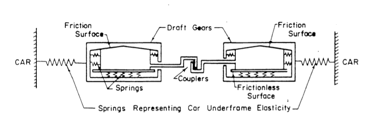
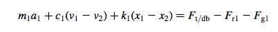
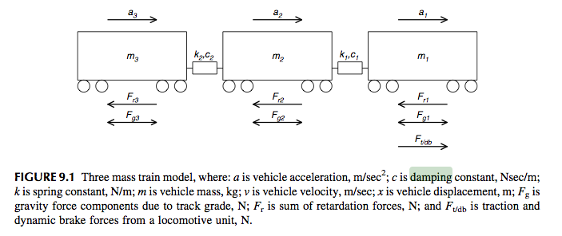

# Bağlantılar

Bağlantılar diğer adıyla **coupling** yapıları iki aracı birbirine bağlanmaya ve/veya araçlar arasında güç aktarmaya yarayan sistemlerdir.
Bir coupling'in genel yapısı aşağıdaki şekildedir:

#### Bağlantı sabitleri

+ Damping sabiti (bağlantı yayının/yaylarının damping sabiti)
+ Spring sabiti (bağnatı yayının sabiti)

#### Kuvvet
Bağlantının aktardığı kuvveti bulmak için çeşitli denklemler bulunmaktadır. Bu projede aşağıda belirtilen bağlantı kuvveti hesaplama denklemi kullanılmıştır.3

`m` ve `a` sırasıyla kütle ve ivmeyi, `c` damping sabiti, `k` spring sabitidir. Denklemin sağ el tarafı net kuvvet olarak coupling kuvvetini bize vermektedir.

Bağlantı kuvvetinin integrasyon sürecinde simülasyonun bir sonraki adımı kuvvetin hesaplama adımından her zaman bir `dt` hesabı kadar önde olması gerekmektedir.4
