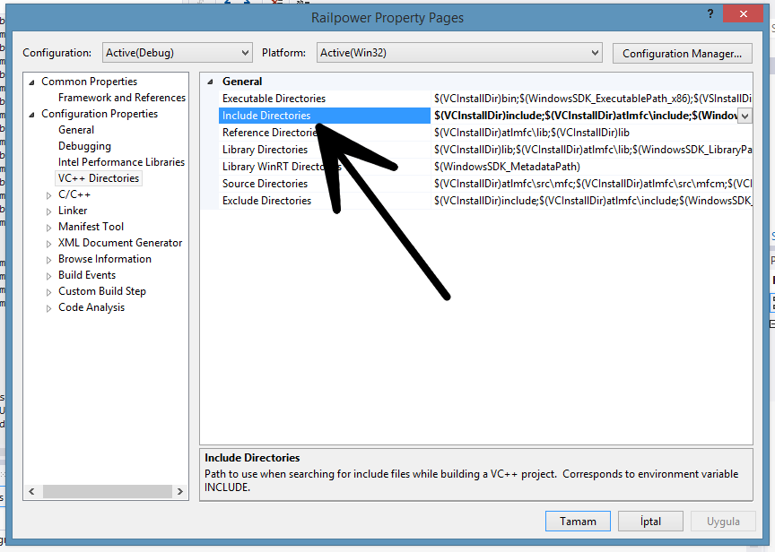
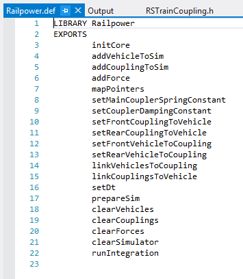

# Gelistirme

## Windows

### Visual Studio ortamında

Varsayılan olarak depoda `cpp-vs` dizini altında visual studio için oluşturulmuş(Visual Studio 2012 Ultimate ile) ve konfigürasyonu hazırlanmış bir proje vardır. Proje konfigürasyonu farklı bir projeye aktarılacaksa aşağıdaki adımlar izlenmelidir.

Visual Studio ortamında geliştirme yapılacaksa `global.h` dosyasında değişikliğe gidilmesi gerekmektedir.

Aşağıda var olan `global.h`:
```cpp
#ifndef GLOBAL_H
#define GLOBAL_H

#if defined RAILPOWER
#define RAILPOWER_SHARED __declspec(dllexport)
#else
#define RAILPOWER_SHARED __declspec(dllimport)
#endif

#endif // GLOBAL_H
```
Değişim:

```cpp
#ifndef GLOBAL_H
#define GLOBAL_H

#include <stdafx.h>

#if defined RAILPOWER
#define RAILPOWER_SHARED __declspec(dllexport)
#else
#define RAILPOWER_SHARED __declspec(dllimport)
#endif

#endif // GLOBAL_H
```
**Yukarıda değişen konfigürasyon boş olmayan VS projeleri içindir**
bu işlem sonrasında kütüphaneler ve headerlar visual studio'nun arama patikasına eklenir.

Patikanın eski hali aşağıdaki gibi iken:
```
BLABLABLABLA;$(WindowsSDK_IncludePath);
```
yeni hali aşağıdaki gibi olmalıdır.
```
BLABLABLABLA;$(WindowsSDK_IncludePath);.;
```
Bu ayar aşağıdaki pencereden değiştirilir:



## Qt Creator ortamında
`*.pro` dosyasında her zaman aşağıdaki satırların bulunmasına dikkat edilmelidir.

Aşağıdaki konfigürasyon parçacığı `pro` dosyasının en başında:
```
TEMPLATE = lib

CONFIG += dll
CONFIG += c++11
```
Aşağıdaki parçacık ise en sonunda mutlaka olmalıdır:
```
INCLUDEPATH += .

DEFINES += RAILPOWER

# __stdcall flags
#QMAKE_CFLAGS += /Gz
#QMAKE_CXXFLAGS += /Gz
DEF_FILE = Railpower.def

OTHER_FILES += \
    Railpower.def
```


## Genel Konvansiyonlar

Her DLL dışına export edilmesi istenen fonksiyon `Railpower.def` dosyasına aşağıda görülen yapıda yazılması gerekmektedir.



Bir kodlama yapılanması olarak ebeveyn dosya diğer dosyalardaki yapıları kullanmaktadır. Ebeveyn dosya diğer dosyalar gibi camelCasing ile yazılmamıştır. Ebeveyn dosya projede `railpower.cpp` ismi ile fark edilebilir.

Bu dosya dışarıya export edilecek fonksiyonların yazım noktasıdır. Bu kısımda olabildiğince kompakt bir yapı sergileyip kullanım sırasına göre yazmamız bizim açımızdan birbirine yakın export edilmiş fonksiyonların derleyici tarafından oluşturulmasını sağlayacaktır. Aynı zamanda bu bize hızlı bir sistem de sağlar.

`railpower.h` içerisinde bu exportlar aşağıdaki örnek satırlar gibi sırasıyla yazılmalıdır. Bu genel konvansiyondur. Sistem esnektir, istenildiği gibi değişkiliğe gidilebilir.

```cpp
.
.
.

extern "C" RAILPOWER_SHARED int addCouplingToSim(double frontDistRefToCoupling, double rearDistRefToCoupling, double tensionDistance, bool nullify);
extern "C" RAILPOWER_SHARED int addForce(int vehIndex, double startTime, double stopTime, double forceValue);
extern "C" RAILPOWER_SHARED int mapPointers();
extern "C" RAILPOWER_SHARED int setMainCouplerSpringConstant(int coupIndex, double sprConst);

.
.
.
```
