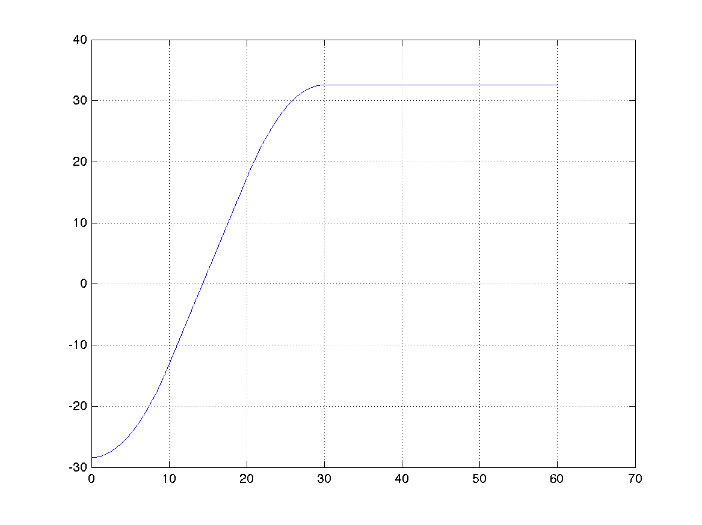

# Sonuçlar ve Test Paketleri

Bölüm `1.4`te belirtildiği üzere script yeniden kullanılarak (her durum için farklı veya araç sayısı arttıkça durumları yönetip görselleştirmeyi yapan bir script) 3 test paketi aşağıdaki şekilde başarıyla ve hata oranı belirlenen şekilde geçmiştir.6

## Test 1 Pack

Test 1 için beklenen değerler:

Test 1'in **Railpower** değerleri:
* * *
### İvme

### Hız

### Pozisyon

* * *

## Test 2 Pack

Test 2 için beklenen değerler:

Test 2'nin **Railpower** değerleri:
* * *
### İvme 1. araç

### Hız 1. araç

### Pozisyon 1.araç

* * *
### İvme 2. araç

### Hız 2. araç

### Pozisyon 2.araç

* * *

## Test 3 Pack

Test 3 için beklenen değerler:

Test 3'nin **Railpower** değerleri:
* * *
### İvme 1. araç

### Hız 1. araç

### Pozisyon 1.araç

* * *
### İvme 2. araç

### Hız 2. araç

### Pozisyon 2.araç

* * *
### İvme 3. araç

### Hız 3. araç

### Pozisyon 3.araç

Testlerin validasyonu yapılmıştır.6
