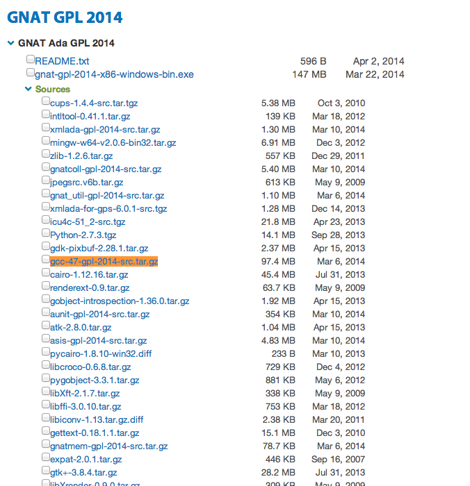

# Derleme

## Derleme ortamının hazırlanması
### Derleyicinin yüklenmesi
Derleme'nin yapılabilmesi için http://gcc.gnu.org/projects/cxx0x.html
adresinde belirtilen `Null pointer constant` ifadesinin en az derleyici tarafından sağlanması gerekmektedir.

Bu yüzden GCC kullanılacaksa(ki proje derlenirken GCC kullanılmıştır)

GCC binary'sini http://www.cygwin.com/ üzerinden yükleyebilirsiniz.
veya:
http://libre.adacore.com/download/configurations adresinden `gnat-gpl-YYYY-x86-windows-bin.exe` paketini kurup sisteme kurulan GCC çalıştırabilirinin yolu `Ortam Değişkenleri`nden `PATH`e eklenmesi gerekmektedir.

### IDE'nin yüklenmesi

Halihazırda proje Qt Creator kullanılarak oluşturulmuştur.
