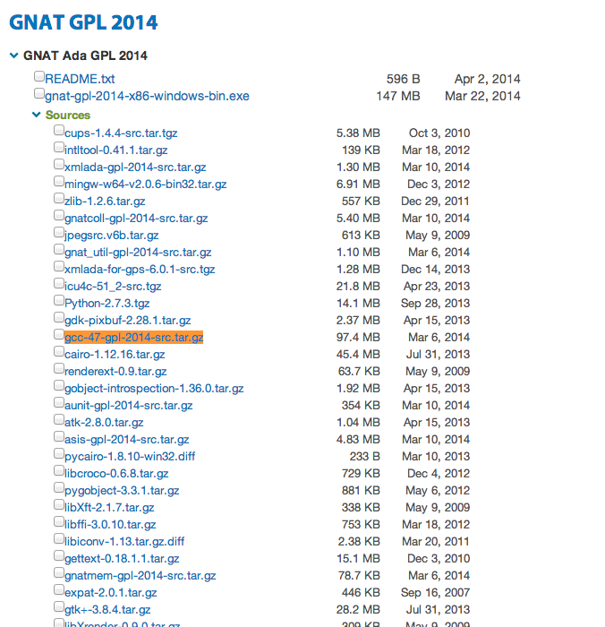
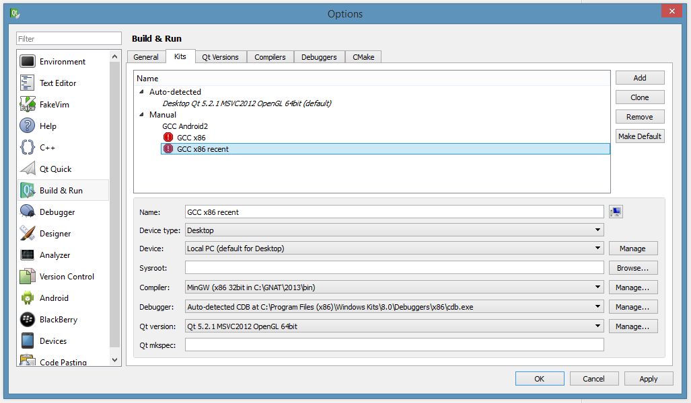
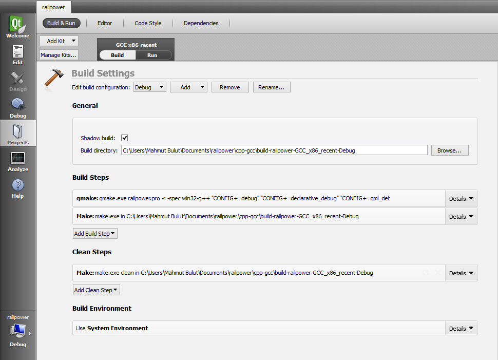

# Derleme
Bu kısımda proje dizini olarak anılacak kısım ana depo dizini altında bulunan `cpp-gcc` dizinidir. `xcode`,`cpp-vs` ve `cpp-gcc` haricindeki dizinler deneysel çalışmalar içermektedirler.

## Derleme ortamının hazırlanması
### Derleyicinin yüklenmesi ve konfigürasyonu
Derleme'nin yapılabilmesi için http://gcc.gnu.org/projects/cxx0x.html
adresinde belirtilen `Null pointer constant` ifadesinin en az derleyici tarafından sağlanması gerekmektedir.

Bu yüzden GCC kullanılacaksa(ki proje derlenirken GCC kullanılmıştır)

GCC binary'sini http://www.cygwin.com/ üzerinden yükleyebilirsiniz.
veya:
http://libre.adacore.com/download/configurations adresinden `gnat-gpl-YYYY-x86-windows-bin.exe` paketini kurup sisteme kurulan GCC çalıştırabilirinin yolu `Ortam Değişkenleri`nden `PATH`e eklenmesi gerekmektedir.

## Bağımlılıkların yüklenmesi ve konfigürasyonu
### Boost kütüphanesi
Proje dizininde boost kütüphanesi `header-only` dağıtımı baz alınarak bulunmaktadır. Versiyonu `1.55.0`dır.
Boost kütüphanesi derlenerek projeye dahil edilebilir. Statik derlenecek olan boost ileride DLL için linklenecektir.

### Thrust kütüphanesi
Thrust kütüphanesi entegrasyonu tamamlanmamıştır. Üzerinde çalışılmaktadır.

### IDE'nin yüklenmesi ve konfigürasyonu

Halihazırda proje Qt Creator kullanılarak oluşturulmuştur. Qt Creator http://qt-project.org sitesinden indirilebilir.

Kurulum sonrasında ana dizin içinde bulunan proje dizininde (cpp-gcc dizini) `railpower.pro` dosyası açılarak qt creator ide'sinde projenin açılması sağlanır. İlk konfigürasyon `Tools->Options->Build & Run->Kits` sekmesinde `GCC`'nin ideye tanıtılmasıdır.

Örnek konfigürasyon aşağıdaki gibidir. Qt SDK'nın yüklü olması opsiyoneldir.

İkinci konfigürasyon ise build steplerinin oluşturulmasıdır. Bir önceki konfigürasyonda doğru yapılandırılma yapıldı ise bu konfigürasyon projenin `*.pro` dosyasından otomatik yüklenecektir. (64bit gcc kullanıyor ve versiyonunuz farklı ise bu konfigürasyon da yüklenmeyecektir.)

## Derleme yapmak
Derleme yapmak için build'e tıklanması yeterlidir.

* * *
* * *
#### Mac OS
Xcode projesi aynı adlı dizininde Mac işletim sistemlerinde en verimli şekilde çalışır halde bulunmaktadır. Xcode versiyonu 5.*'dan büyük her xcode bu projeyi gereğince derleyebilmektedir.

